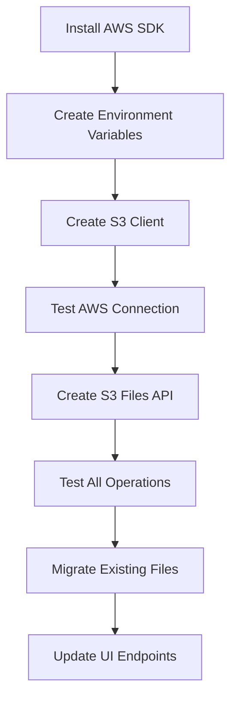

# Tasks and Improvements

## Current Priority: AWS Integration 🔥

### Phase 2: AWS Setup & Configuration (IMMEDIATE)
- [ ] **Install AWS SDK** - Add @aws-sdk/client-s3 to package.json
- [ ] **Create Environment Variables** - Set up .env.local with AWS credentials
- [ ] **Create S3 Client** - Configure lib/s3Client.ts for AWS connection
- [ ] **Test AWS Connection** - Verify credentials and bucket access

### Phase 3: API Implementation (HIGH PRIORITY)
- [ ] **Create S3 Files API** - app/api/s3-files/route.ts (List, Upload, Delete)
- [ ] **Create S3 File Detail API** - app/api/s3-files/[filename]/route.ts (Get, Update)
- [ ] **Implement S3 File Operations** - Replace local file operations with S3
- [ ] **Add Error Handling** - Network errors, AWS errors, authentication failures
- [ ] **Maintain API Compatibility** - Keep existing interface for UI

### Phase 4: Testing & Migration (MEDIUM PRIORITY)
- [ ] **Test All Operations** - CRUD operations on S3 files
- [ ] **Migrate Existing Files** - Move local files to S3 bucket
- [ ] **Update UI Endpoints** - Switch from local to S3 API endpoints
- [ ] **Backup Strategy** - Ensure no data loss during migration

## Existing Features to Maintain

### Authentication & Security
- [x] Firebase Authentication integration
- [x] Protected API routes with token verification
- [x] User session management
- [ ] **Secure AWS credentials handling**

### JSON File Management
- [x] File listing with metadata (size, last modified)
- [x] File upload with JSON validation
- [x] File editing with professional UI
- [x] File deletion with confirmation
- [ ] **Migrate to S3 storage**

### Dashboard & UI
- [x] Professional responsive dashboard
- [x] JSON management section with stats
- [x] File operations (upload, edit, delete)
- [x] Beautiful JSON editor with modal-based editing
- [x] Mobile-responsive interface

### Notification System
- [x] Multi-language notification templates (EN, AR, KU)
- [x] Firebase-based template storage
- [x] Template management (CRUD operations)
- [x] Professional admin interface

## Future Enhancements (LOW PRIORITY)

### Performance Optimization
- [ ] Implement file caching for frequently accessed files
- [ ] Add file compression for large JSON files
- [ ] Implement connection pooling for AWS operations
- [ ] Add pagination for large file lists

### Advanced Features
- [ ] File versioning and history
- [ ] File sharing and collaboration
- [ ] Advanced search and filtering
- [ ] Batch operations (upload multiple files)
- [ ] File import/export functionality

### Monitoring & Analytics
- [ ] Add file access logging
- [ ] Usage analytics dashboard
- [ ] Error tracking and monitoring
- [ ] Performance metrics

### Security Enhancements
- [ ] File access permissions
- [ ] Audit trail for file operations
- [ ] Advanced authentication options
- [ ] Rate limiting for API endpoints

## Completed Tasks ✅

### Project Foundation
- [x] Next.js 15 project setup with TypeScript
- [x] Firebase Authentication integration
- [x] Tailwind CSS with shadcn/ui components
- [x] Professional project structure

### Core Features
- [x] JSON file management system
- [x] Professional dashboard interface
- [x] Beautiful JSON editor with modal editing
- [x] File upload, edit, delete operations
- [x] Mobile-responsive design

### Notification System
- [x] Multi-language notification templates
- [x] Firebase-based template storage
- [x] Template CRUD operations
- [x] Professional admin interface

### Documentation
- [x] Comprehensive project documentation
- [x] Change tracking system
- [x] File structure documentation
- [x] Setup and deployment guides

## Task Dependencies

## Immediate Action Items
1. **Install AWS SDK** - Required for all S3 operations
2. **Set up environment variables** - AWS credentials and configuration
3. **Create S3 client** - Core component for AWS integration
4. **Test connection** - Verify everything works before proceeding

## Immediate Priority Tasks

### 🔥 Critical Setup Tasks
1. **Firebase Configuration**
   - Set up Firebase project and enable Authentication
   - Configure service account and download credentials
   - Update `.env.local` with actual Firebase config values
   - Create actual `firebase.service.json` from template

2. **Dependency Installation**
   - Run `npm install` to install all dependencies
   - Verify all shadcn/ui components work correctly
   - Test Firebase SDK integration

3. **Authentication Setup**
   - Create test user account in Firebase Console
   - Test login/logout functionality
   - Verify protected route access

## Medium Priority Enhancements

### 🔧 Functionality Improvements
1. **User Management**
   - Add user registration functionality
   - Implement password reset flow
   - Add user profile management

2. **JSON Editor Enhancements**
   - Add JSON validation before saving
   - Implement backup/restore functionality
   - Add JSON import/export features
   - Support for multiple JSON files

3. **Security Improvements**
   - Add rate limiting to API routes
   - Implement session management
   - Add audit logging for file changes

### 🎨 UI/UX Improvements
1. **Enhanced Interface**
   - Add dark mode toggle
   - Improve mobile responsiveness
   - Add loading states and animations
   - Implement toast notifications for better feedback

2. **Editor Features**
   - Add JSON syntax highlighting
   - Implement undo/redo functionality
   - Add search and replace in JSON
   - Schema validation support

## Long-term Strategic Tasks

### 📈 Scalability
1. **Performance Optimization**
   - Implement caching strategies
   - Add compression for large JSON files
   - Optimize bundle size
   - Add progressive loading

2. **Multi-tenancy**
   - Support multiple users with separate data
   - Implement role-based access control
   - Add team collaboration features

3. **Advanced Features**
   - Real-time collaborative editing
   - Version control for JSON changes
   - API for external integrations
   - Webhook support for notifications

### 🚀 Deployment & DevOps
1. **Production Readiness**
   - Add comprehensive error monitoring
   - Implement health checks
   - Add automated testing
   - Set up CI/CD pipeline

2. **Infrastructure**
   - Docker containerization
   - Kubernetes deployment
   - CDN integration
   - Database migration (from file to DB)

## Priority Assessment

### High Priority (Complete within 1 week)
- Firebase setup and configuration
- Basic authentication testing
- Core JSON editing functionality verification

### Medium Priority (Complete within 1 month)
- User management features
- Enhanced security measures
- UI/UX improvements

### Low Priority (Future releases)
- Advanced collaborative features
- Full infrastructure automation
- Extended API capabilities

## Dependencies & Blockers

### External Dependencies
- Firebase project setup (requires Google account)
- Domain setup for production deployment
- SSL certificate configuration

### Technical Dependencies
- Node.js 18+ environment
- Modern browser support
- Stable internet connection for Firebase services

## Success Metrics

### Technical Metrics
- Authentication success rate > 99%
- JSON save/load operations < 1s response time
- Zero security vulnerabilities in dependencies
- 100% TypeScript coverage

### User Experience Metrics
- Login time < 3 seconds
- JSON editor responsiveness < 500ms
- Error rate < 1%
- User satisfaction score > 4.5/5

## Notes

- All tasks should follow the established coding standards
- Security considerations must be evaluated for each enhancement
- Performance impact should be measured before implementing new features
- User feedback should guide priority adjustments 